## From docker to production on Amazon ECS
Twitter: [@ric__harvey](https://twitter.com/ric__harvey)
### Take aways

By the end of this lab session you'll have seen built a full VPC and Hybrid AWS Fargate and Amazon ECS cluster. Into this cluster you'll learn how to deploy a container service using a CI/CD pipeline.

### Requirements

- AWS account
- AWS CLI installed + configured with your API keys
- Docker engine installed (locally)
- Git CLI installed

### Expected time

You should be able to deploy this in 30-40 mins

### Solution overview

We are going to use the AWS technologies listed below to build a CI/CD pipeline that once you commit changes to your master branch of your docker repository in git a rebuild and redeploy process will kick off, allowing you to update and test teh docker image locally and then deploy to production easily.

Products used:

- Amazon ECS
- Amazon ECR
- AWS CodeCommit
- AWS CodePipeline
- AWS CodeBuild

##### High level ovewrview diagram

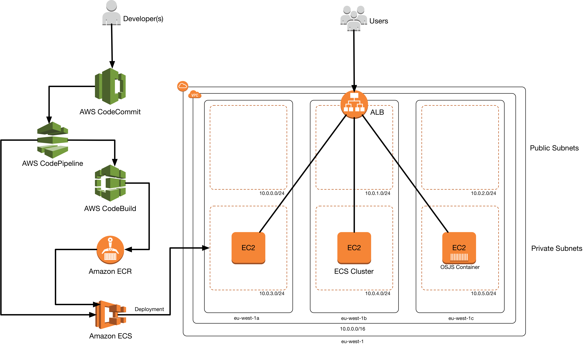

## Exercise
### Getting started

First we need to build an image and test it. For this we are using the [OS.js](https://www.os-js.org/) project which is a virtual desktop you can run in your browser. First lets prepare and build your image.

For this we are going to create a new AWS CodeCommit repository. But lets make sure you have ssh access to your git repositories first.

Generate a new SSH key:

```bash
ssh-keygen

Generating public/private rsa key pair.
Enter file in which to save the key (/drive/Users/user-name/.ssh/id_rsa): Type a file name here, for example /c/Users/user-name/.ssh/codecommit_rsa

Enter passphrase (empty for no passphrase): <Type a passphrase, and then press Enter>
Enter same passphrase again: <Type the passphrase again, and then press Enter>

Your identification has been saved in drive/Users/user-name/.ssh/codecommit_rsa.
Your public key has been saved in drive/Users/user-name/.ssh/codecommit_rsa.pub.
The key fingerprint is:
45:63:d5:99:0e:99:73:50:5e:d4:b3:2d:86:4a:2c:14 user-name@client-name
The key's randomart image is:
+--[ RSA 2048]----+
|        E.+.o*.++|
|        .o .=.=o.|
|       . ..  *. +|
|        ..o . +..|
|        So . . . |
|          .      |
|                 |
|                 |
|                 |
+-----------------+
```
This generates:

- The codecommit_rsa file, which is the private key file.
- The codecommit_rsa.pub file, which is the public key file.

Copy the contents of codecommit_rsa.pub (it may be in your .ssh directoty)

Now Sign in to [https://console.aws.amazon.com/iam/](https://console.aws.amazon.com/iam/)

In the IAM console, in the navigation pane, choose Users, and from the list of users, choose your IAM user.

On the user details page, choose the Security Credentials tab, and then choose Upload SSH public key.

Paste the contents of your SSH public key into the field, and then choose Upload SSH public key.

Copy or save the information in SSH Key ID (for example, APKAEIBAERJR2EXAMPLE). This is your SSH username.

Create a file called ~/.ssh/config and add the following information taking note to change User and IdentityFile Locations

```
Host git-codecommit.*.amazonaws.com
  User APKAEIBAERJR2EXAMPLE
  IdentityFile ~/.ssh/codecommit_rsa
```

Now lets create and clone a repository:

```bash
aws codecommit create-repository --repository-name osjs --region eu-west-1
{
    "repositoryMetadata": {
        "accountId": "210944566071",
        "repositoryId": "271c3e97-6a6a-4e4c-a3d7-de7f0e272897",
        "repositoryName": "osjs",
        "lastModifiedDate": 1525696265.885,
        "creationDate": 1525696265.885,
        "cloneUrlHttp": "https://git-codecommit.eu-west-1.amazonaws.com/v1/repos/osjs",
        "cloneUrlSsh": "ssh://git-codecommit.eu-west-1.amazonaws.com/v1/repos/osjs",
        "Arn": "arn:aws:codecommit:eu-west-1:210944566071:osjs"
    }
}
```
Copy the cloneUrlSsh value and run:

```bash
git clone ssh://git-codecommit.eu-west-1.amazonaws.com/v1/repos/osjs
```

### Running locally

Now lets create our docker image and test locally in the root of the osjs directory create a new file called Dockerfile and add the following conents:

```docker
FROM debian:latest
MAINTAINER Ric Harvey <rjh@amazon.com>

RUN apt-get update && \
    apt-get install -y curl gnupg git && \
    curl -sL https://deb.nodesource.com/setup_8.x | bash - && \
    apt-get install -y nodejs

RUN git clone https://github.com/os-js/OS.js.git && cd OS.js

WORKDIR OS.js

RUN npm install
RUN node osjs build

CMD node osjs run
```

This is going to build the OSJS software on a debian base image.

**Note:** you should consider stripping down this file to get a smaller build.

Lets build and test the image:

```bash
docker build -t osjs:latest .
docker run -p 8000:8000 osjs:latest
```

Now head to your web browser and go to http://localhost:8000 you should get something like the following:

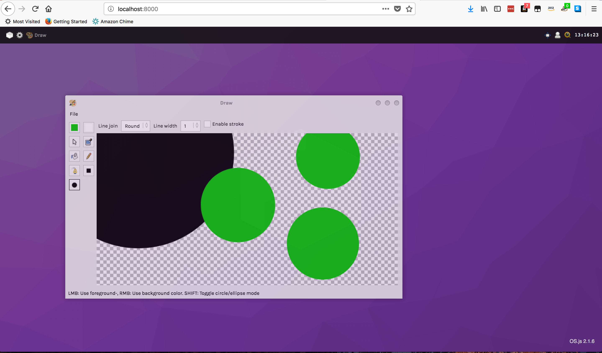

Have a play and take mental note of the menu options. This is how we'll test CI/CD is working later.

### Starting a cluster

Ok so we now have a working docker image locally that we can debug and test with. But what about deploying this in production? Lets create an ECS cluster in our AWS account ready to take the containers.

##### VPC design

First we are going to need a VPC into which we'll deploy our ECS instances. We are going to use cloudformation and deploy three public subnets and three private subnets, our ECS instances will be in the provate subnet and we'll use load balancers to make this publically accessible.

In this git repository there is a folder called cloudformation. This contains our files for building our VPC.

Open the AWS console in your browser and go to cloudformation. Press Create Stack.

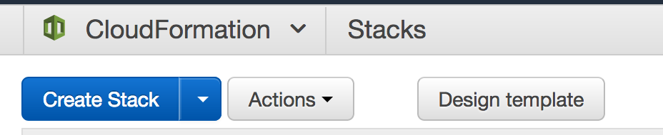 

Select upload template to S3 and find the file named **_public-private-vpc.yml_**

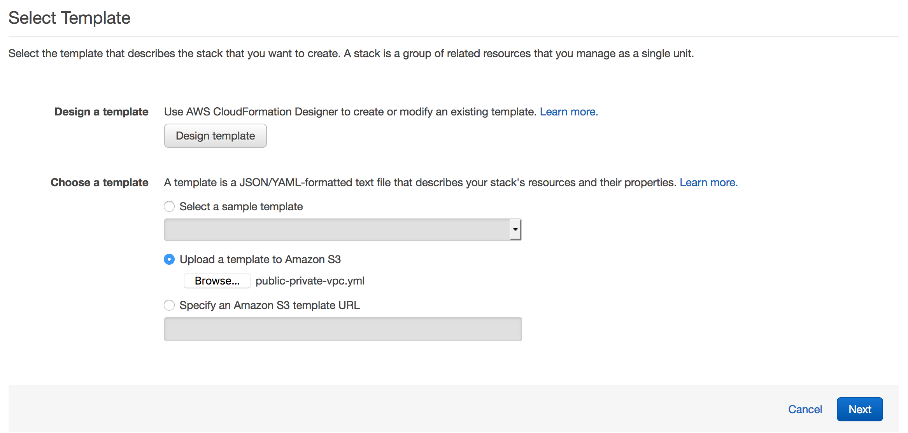

Answer a few questions such as stack name and set your Environment variable. This varibale needs to be the same in the next twoo templates.

Wait for this to complete in the console.

##### Cluster creation

Once its completed we are going to upload two more stacks. One to create a ECS cluster namespace that can run fargate or ECS containers, we'll also create an internal and external facing ALB for connecting to our containers. The second file will bring three ECS hosts to your ECS cluster config, one in each AZ.

Press Create Stack again and upload the **_cluster.yml_** file. Once complete head over to the ECS console and copy the cluster name of your newly created cluster.

Now go back to Cloudformation and create the final stack in the same way. this one is called **_ecs-hosts.yml_**. You'll need to enter the environment name and the cluster name you just copied. once the hosts start you have a fully working cluster.

When creating this document I created an environment called 'dev' I ended up with three stacks created.

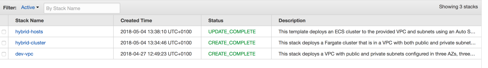

### Version control and docker registry

Right we need to do two things now. Firstly lets commit our code to git. Secondly we'll create a docker repository for the OSJS image we built locally. In your terminal go to the git repository you cloned earlier and run the following commands:

```bash
git add .
git commit -am "first commit"
git push
```

Now go to the ECS console in your web browser and click on repositories.


Create a new repository called osjs:

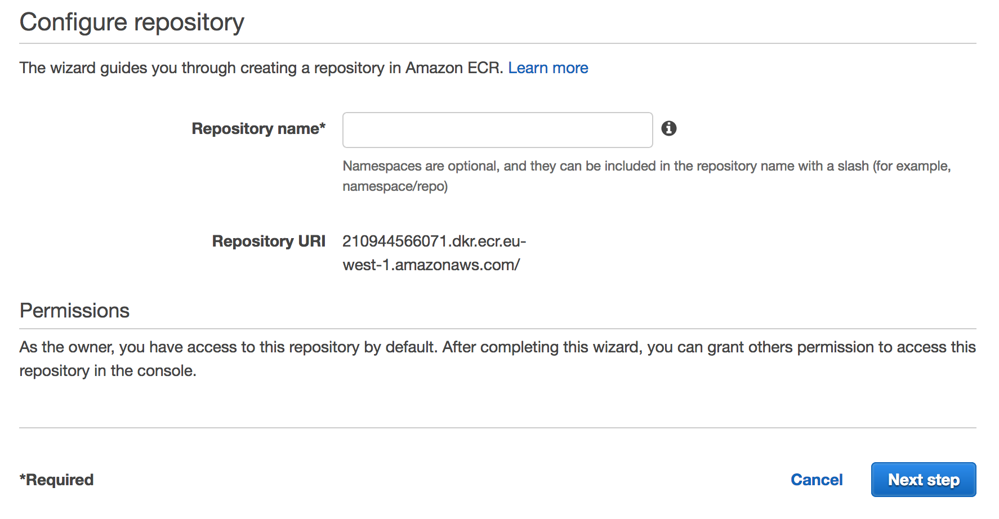

Run the following command in your terminal:

```bash
$(aws ecr get-login --no-include-email --region eu-west-1)
```

This will set up docker with credentials to be able to use the docker tools from the commandline.

Now lets tag and push the image we built earlier:

```bash
docker tag osjs:latest 210944566071.dkr.ecr.eu-west-1.amazonaws.com/osjs:latest

docker push 210944566071.dkr.ecr.eu-west-1.amazonaws.com/osjs:latest
```

Your image is now uploaded and ready to be used. make a note of your repository URL.

### Create a task and a Service for ECS

We now need to create a task definition to tell ECS how to run our new image. We'll also need a Service definition to tell ECS how many copies of that task to run and how to connect it to the ALB.

Lets go to the ECS cluster and click Task Definitions and create new.

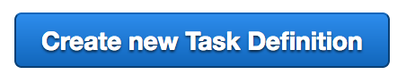

Choose EC2 as the launch type.

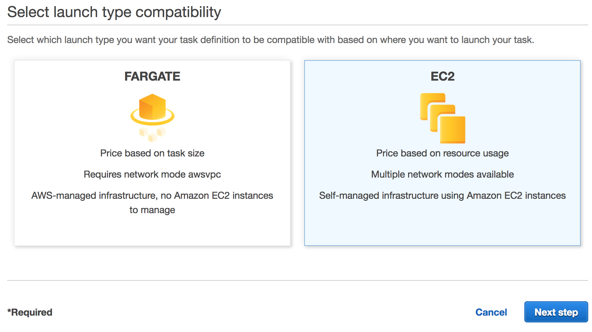

Set the following variables in the wizard:

- **Task Definition Name:** osjs-desktop
- **Task Role:** yourName-cluster-ECSTaskExecutionRole-FGHDFhgdhj
- **Network mode:** awsvpc
- **Task memory (MiB):** 512
- **Task CPU (unit):** 1024

Now click add container and set the follwoing values:

- **Container name:** osjs-desktop
- **image:** your image URL (eg. 210944566071.dkr.ecr.eu-west-1.amazonaws.com/osjs:latest)
- **Hard Limit:** 512
- **Port Mapping:** 8000 TCP

Now click Add, then Create.

Lets set up the service and run this now!

Go to actions on the task you just created and select create service.

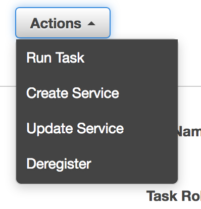

Set the following values:

- **Launch Type:** EC2
- **Service name:** osjs-desktop
- **Number of tasks:** 1

Click next and set up the network details.

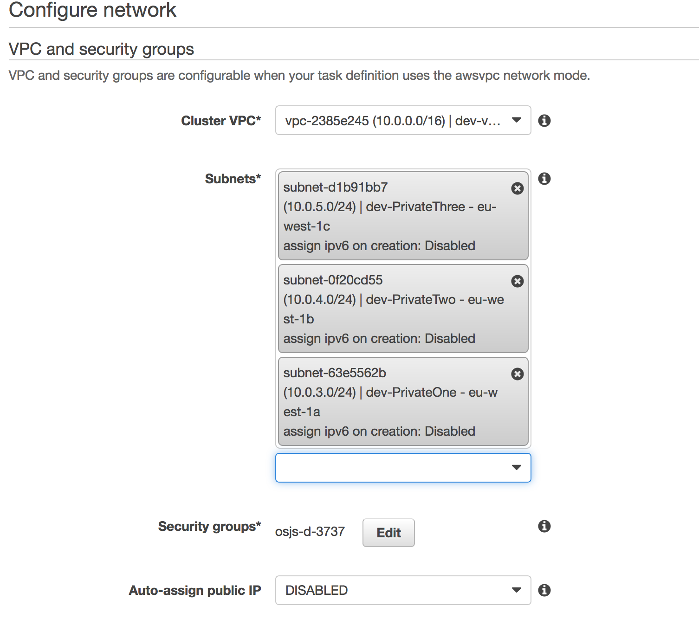

In this example VPC is 10.0.0.0/16 and the network subnets are 10.0.3.0/24, 10.0.4.0/24 and 10.0.5.0/24. These are the private subnets and where the AWSVPC driver will create the tasks Elastic Network Interface (ENI)

Edit the security group:

Change tpe to **Custom TCP** and set the port to **8000**

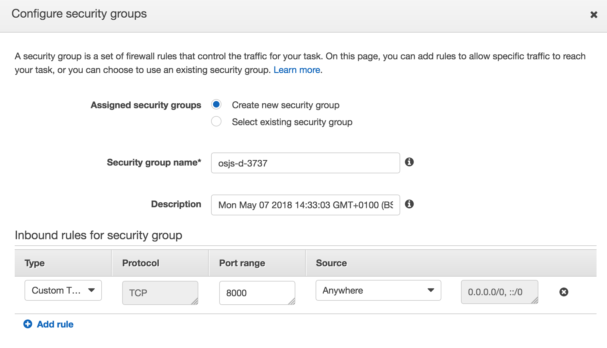

**Note:** in production you'd want to lock this down better

Save the Security Group and scroll to the Load Balancing section.

Select Application Load Balancer and choose your Public Load Balancer.

Add the container and port to the ALB.

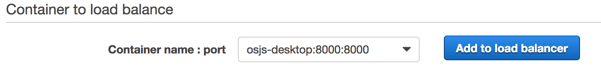

Set the listener for the ALB:

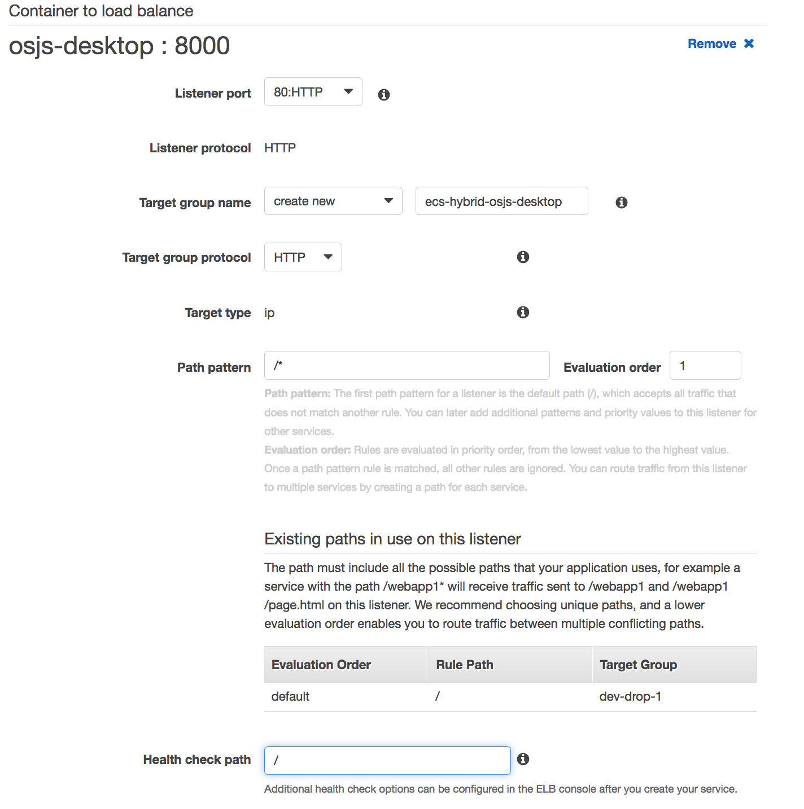

Untick **Enable service discovery integration**

Click through and Create the service. The service will show as pending.

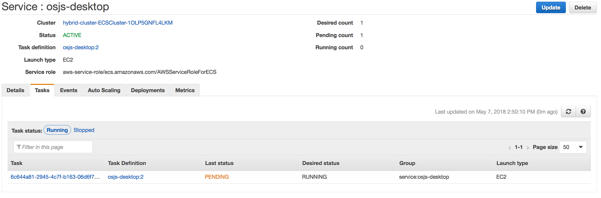

Once finished it will show as running.

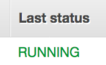

Now go to the EC2 section on the AWS console and click on Load Balancers on the right hand side. Find your public load balancer and copy the DNS name.

Visit the URL you just copied in your browser and you should see your OSJS Desktop!

### Automating docker builds

now we'll AWS CodeBuild to build your Docker image and push the image to Amazon ECR. Lets add a buildspec.yml file to your source code repository to tells AWS CodeBuild how to do that (this is the git repo you created at the begining). The example build specification below does the following:

- Pre-build stage:
  - Log in to Amazon ECR.
  - Set the repository URI to your ECR image and add an image tag with the first seven characters of the Git commit ID of the source.

- Build stage:
  - Build the Docker image and tag the image both as latest and with the Git commit ID.

- Post-build stage:
  - Push the image to your ECR repository with both tags.
  - Write a file called imagedefinitions.json in the build root that has your Amazon ECS service's container name and the image and tag. The deployment stage of your CD pipeline uses this information to create a new revision of your service's task definition, and then it updates the service to use the new task definition. The imagedefinitions.json file is required for the AWS CodeDeploy ECS job worker.

##### Create the buildspec

create the following file in your git repo:

buildspec.yml:

```yaml
version: 0.2

phases:
  pre_build:
    commands:
      - echo Logging in to Amazon ECR...
      - aws --version
      - $(aws ecr get-login --region eu-west-1 --no-include-email)
      - REPOSITORY_URI=210944566071.dkr.ecr.eu-west-1.amazonaws.com/osjs
      - IMAGE_TAG=$(echo $CODEBUILD_RESOLVED_SOURCE_VERSION | cut -c 1-7)
  build:
    commands:
      - echo Build started on `date`
      - echo Building the Docker image...
      - docker build -t $REPOSITORY_URI:latest .
      - docker tag $REPOSITORY_URI:latest $REPOSITORY_URI:$IMAGE_TAG
  post_build:
    commands:
      - echo Build completed on `date`
      - echo Pushing the Docker images...
      - docker push $REPOSITORY_URI:latest
      - docker push $REPOSITORY_URI:$IMAGE_TAG
      - echo Writing image definitions file...
      - printf '[{"name":"osjs-desktop","imageUri":"%s"}]' $REPOSITORY_URI:$IMAGE_TAG > imagedefinitions.json
artifacts:
    files: imagedefinitions.json
```

You'll need to change the values of:

- REPOSITORY_URI (to your ECR repo for the osjs docker image)
- printf (only if you changed the name of the service from osjs-desktop)

Now add this to git:

```bash
git add .
git commit -am "Adding buildspec"
git push
```

### Automating deployments

##### Creating Your Continuous Deployment Pipeline

Use the AWS CodePipeline wizard to create your pipeline stages and connect your source repository to your ECS service.

To create your pipeline

- Open the AWS CodePipeline console at https://console.aws.amazon.com/codepipeline/.

- On the Welcome page, choose Create pipeline.
  - If this is your first time using AWS CodePipeline, an introductory page appears instead of Welcome. Choose Get Started Now.

- On the **Step 1: Name** page, for **Pipeline name**, type the name for your pipeline and choose Next step. For this tutorial, the pipeline name is **osjs-desktop**.

- On the **Step 2: Source** page, for **Source provider**, choose **AWS CodeCommit**.
  - For **Repository name**, choose the name of the AWS CodeCommit repository to use as the source location for your pipeline.
  - For **Branch name**, choose the branch to use and choose Next step.

- On the **Step 3: Build** page, choose **AWS CodeBuild**, and then choose **Create a new build project**.
 - For Project name, choose a unique name for your build project. For this tutorial, the project name is osjs-desktop.
 - For Operating system, choose Ubuntu.
 - For Runtime, choose Docker.
 - For Version, choose aws/codebuild/docker:17.09.0 . (or higher)
 - Choose Save build project.
 - Choose Next step.

**Note:** The wizard creates an AWS CodeBuild service role for your build project, called code-build-build-project-name-service-role. Note this role name, as you add Amazon ECR permissions to it later.

- On the **Step 4: Deploy** page, for **Deployment provider**, choose **Amazon ECS**.
 - For Cluster name, choose the Amazon ECS cluster in which your service is running. 
 - For Service name, choose the service to update and choose Next step. For this tutorial, the service name is osjs-desktop.

- On the **Step 5: Service Role** page, choose **Create role**. On the IAM console page that describes the role to be created for you, choose **Allow**.

- Choose **Next step**.

- On the **Step 6: Review** page, review your pipeline configuration and choose **Create pipeline** to create the pipeline.

**Note:** Now that the pipeline has been created, it attempts to run through the different pipeline stages. However, the default AWS CodeBuild role created by the wizard does not have permissions to execute all of the commands contained in the buildspec.yml file, so the build stage fails. The next section adds the permissions for the build stage.

##### Add Amazon ECR Permissions to the AWS CodeBuild Role

The AWS CodePipeline wizard created an IAM role for the AWS CodeBuild build project, called code-build-build-project-name-service-role. For this tutorial, the name is code-build-osjs-desktop-service-role. Because the buildspec.yml file makes calls to Amazon ECR API operations, the role must have a policy that allows permissions to make these Amazon ECR calls. The following procedure helps you attach the proper permissions to the role.

To add Amazon ECR permissions to the AWS CodeBuild role:

- Open the IAM console at https://console.aws.amazon.com/iam/.
- In the left navigation pane, choose **Roles**.
- In the search box, type **code-build-** and choose the role that was created by the AWS CodePipeline wizard. For this tutorial, the role name is code-build-osjs-desktop-service-role.
- On the **Summary page**, choose **Attach policy**.
- Select the box to the left of the **AmazonEC2ContainerRegistryPowerUser** policy, and choose **Attach policy**.

##### Testing the pipeline

Now we have this setup we can go back to the terminal and make a change to the DockerFile. Update the contents to the following:

```docker
FROM debian:latest
MAINTAINER Ric Harvey <rjh@amazon.com>

RUN apt-get update && \
    apt-get install -y curl gnupg git bash && \
    curl -sL https://deb.nodesource.com/setup_8.x | bash - && \
    apt-get install -y nodejs

RUN git clone https://github.com/os-js/OS.js.git && cd OS.js

WORKDIR OS.js

RUN npm install
RUN node osjs build

RUN apt-get install -y build-essential
RUN ./bin/add-package-repo.sh games https://github.com/os-js/OS.js-games.git

CMD node osjs run
```

This will add the **games** package to our desktop. Save the changes and git back to git:

```bash
git commit -am "adding games to desktop"
git push
```

Now if you watch in in the AWS CodePipeline console you'll see the status of your build. Once each section is complete it shoudl turn green.

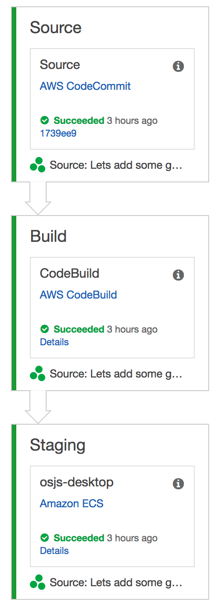

**Note:** you can also click on the Details section of the build process whilst its running and see whats happening.

Now revisit and refresh the OSJS desktop you have open in your browser. Look at the menu's and you now have games you can play!

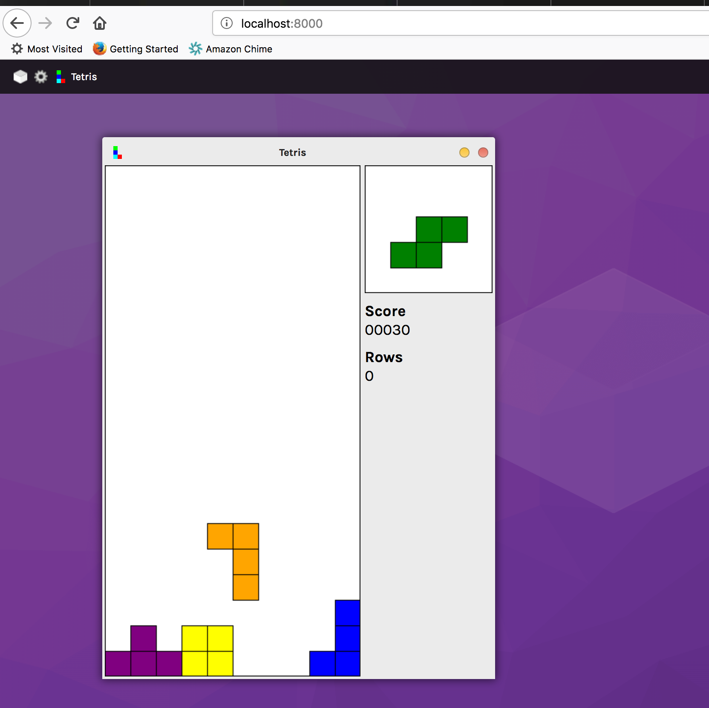
**Note:** Use your ALB URL not localhost!

### Summary

You now have an automated pipeline where if you make a change to your Docker image and commit iot to AWS CodeCommit, the image is automatically rebuilt, stored in AWS ECR and then redeployed on the Amazon ECS Cluster. Of course you can build on this and add some more advanced testing in the pipeline stage. 

### What next?

If you want to take this to the next level, try changing the task and service to run in AWS Fargate. This way you don't have any EC2 hosts to manage.
