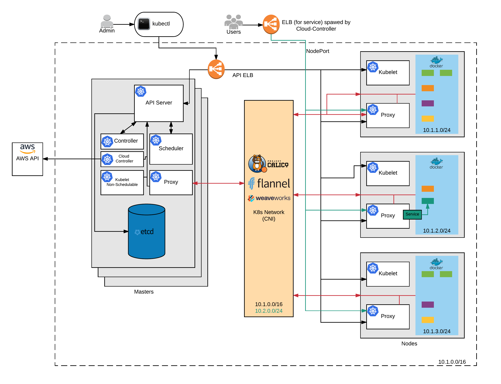

# 101 Introduction

Kubernetes 101 is designed to give you a quick insight into the components and simple operations of a k8s cluster. We'll also cover installing minikube and the kubectl cli on your local machine for testing and running the lab exercises locally to give you experience with kubectl (the kubernetes command line interface). The guide is designed as a high level overview however we will link out to resources should you wish to read more on a given subject.

## Cluster Components

### Overview


(Figure 1: Kubernetes Core Components)


#### Masters

Masters run four (three before 1.6) main components. In production, you should run multiple master servers and a loadbalancer across them. Its normal to run at least 3 masters, this allows the ETCD component to achieve quorum and have election to pick a master node.

##### kube-api-server

kube-apiserver exposes the Kubernetes API. It is the front-end for the Kubernetes control plane and its where the ```kubectl``` command line connects into. In a HA setup this is the service you connect the loadbalancer to.

##### kube-controller-manager

kube-controller-manager runs controllers, which are the background threads that handle routine tasks in the cluster. Logically, each controller is a separate process, but to reduce complexity, they are all compiled into a single binary and run in a single process.

These controllers include:

- Node Controller: Responsible for noticing and responding when nodes go down.
- Replication Controller: Responsible for maintaining the correct number of pods for every replication controller object in the system.
- Endpoints Controller: Populates the Endpoints object (that is, joins Services & Pods).
- Service Account & Token Controllers: Create default accounts and API access tokens for new namespaces.

##### cloud-controller-manager (new after 1.6)

cloud-controller-manager runs controllers that interact with the underlying cloud providers. The cloud-controller-manager binary is an alpha feature introduced in Kubernetes release 1.6.

cloud-controller-manager runs cloud-provider-specific controller loops only.

cloud-controller-manager allows cloud vendors code and the Kubernetes core to evolve independent of each other. In prior releases, the core Kubernetes code was dependent upon cloud-provider-specific code for functionality. In future releases, code specific to cloud vendors should be maintained by the cloud vendor themselves, and linked to cloud-controller-manager while running Kubernetes.

The following controllers have cloud provider dependencies:

- Node Controller: For checking the cloud provider to determine if a node has been deleted in the cloud after it stops responding
- Route Controller: For setting up routes in the underlying cloud infrastructure
- Service Controller: For creating, updating and deleting cloud provider load balancers
- Volume Controller: For creating, attaching, and mounting volumes, and interacting with the cloud provider to orchestrate volumes

##### kube-scheduler

kube-scheduler watches newly created pods that have no node assigned, and selects a node for them to run on.

#### etcd

In A HA production setup you need at least 3 etcd servers. It's a key based store thats used to keep state data about whats happening in the cluster, and the k8s network.

#### nodes

##### kubelet

kubelet is the primary node agent. It watches for pods that have been assigned to its node (either by an api server or via local configuration file) and:

- Mounts the pod’s required volumes.
- Downloads the pod’s secrets.
- Runs the pod’s containers via docker (or, experimentally other OCI run times).
- Periodically executes any requested container liveness probes.
- Reports the status of the pod back to the rest of the system, by creating a mirror pod if necessary.
- Reports the status of the node back to the rest of the system.

##### kube proxy

kube-proxy enables the Kubernetes service abstraction by maintaining network rules on the host and performing connection forwarding.


#### Networking

Kubernetes assumes that pods can communicate with other pods, regardless of which host they land on. We give every pod its own IP address so you do not need to explicitly create links between pods and you almost never need to deal with mapping container ports to host ports. This creates a clean, backwards-compatible model where pods can be treated much like VMs or physical hosts from the perspectives of port allocation, naming, service discovery, load balancing, application configuration, and migration.

##### pod network

The pods normally exist on a /16 network within Kubernetes thats not externally routable. Each node will be assigned a /24 network, this allocation is stored in etcd and is used to help the other nodes route the traffic to the correct controller.

##### services network

Services also have an internal network to Kubernetes. When you assign a service as type ```ClusterIP``` they are assigned an IP from a separate /24 network to the pod network. When you wish to expose the service to external users you use the type ```NodePort``` this uses kube-proxy and iptables to allow ingress to the Kubernetes network. If you assign a service as type ```LoadBalancer``` this is actually built up of a NodePort and ClusterIP and exists on every node, traffic to the pods is then forwarded over the network overlay.

##### CNI

By default Kubernetes uses KubeNet as its network model. However its possible to swap this out to a Container Network Interface (CNI) compatible alternative. A few options are:

- [Project Calico](https://www.projectcalico.org/)
- [Weave](https://www.weave.works/oss/net/)
- [flanneld](https://github.com/coreos/flannel)

and many more. Each option has its pro's and con's so take a good look a the one that suits you. Calico for example is very good at integrating and managing network policies.

## Kubernetes Terminology

Once you have a running k8s cluster there are some basic core concepts you need to understand. These terms are:

- namespaces
- pods
- services
- deployments
- daemon and stateful sets

#### Namespaces

Namespaces are a logical separation of workloads. For example if you created a namespace for application-a, you could create pods, services, etc inside that namespace that are only viewable/accessible when you call kubectl with the ```-n application-a```. This allows you to group related resources for ease of management. Namespaces can become even more powerful when used in conjunction with a network policy and CNI as you can control ingress/egress to pods and services deployed.

#### Pods

At the basic level a pod is a container or a collection of closely related containers. When there are multiple containers they share a local network interface. That is to say that a container running apache on port 80 and a container running mysql on 3306, can access each others service via localhost:80 or locahost:3306.

#### Services

Services are an abstraction of a set of Pods. Whilst pods are born and die services are long living. This allows you to have a stable endpoint for you pods that can change the resources behind it whilst maintaining the same connection policy and access rules. Using a service would allow you to scale a set of pods up and down as demand requires.

#### Deployments

Deployments are a way of providing declarative updates to a set of pods or ReplicaSets. This allows you to do version updates to an application or maintain a minimum number of pods of a given type. These are the new way of doing Replication Controllers and have a more powerful vocab for placement on nodes.

#### Daemon and Stateful Sets

As well as ReplicationSets you'll also see DeamonSets and StatefulSets are used within kubernetes. These all provide distinct ways of deploying pods.

A DaemonSet for example will ensure that exactly one pod is placed on each node. if you scale the nodes the DaemonSet will create a new version of the pod on the new node(s). This is particularly useful when implementing log forwarders from the node host for example.

A StatefulSet has guarantees about ordering. They do so by maintaining a unique, sticky identity for each of their Pods.
Like Deployments, StatefulSets manage Pods that are based on an identical container spec. However, although their specs are the same, the Pods in a StatefulSet are not interchangeable. Each Pod has a persistent identifier that it maintains across any rescheduling.

## Exercises

- Lab 1: [Installing k8s tools](/kubernetes-101/labs/00-tools.md)
- Lab 2: [Install Minikube](/kubernetes-101/labs/01-minikube.md)
- Lab 3: [Basic tool usage](/kubernetes-101/labs/02-basic-usage.md)
- Lab 4: [Intermediate tool usage](/kubernetes-101/labs/03-intermediate-usage.md)

##### Labs : [kubernetes-101](/kubernetes-101/) | [kubernetes-201](/kubernetes-201/) | [kubernetes-301](/kubernetes-301/)
