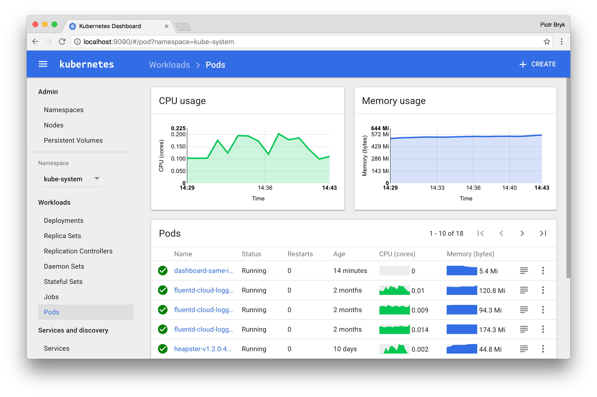

# Lab 2

## minikube

Minikube is a kubernetes led project to install a local testing cluster of kubernetes on you desktop or laptop. Its pretty easy to get up and running so in this lab we'll configure this on your system and ensure kubectl is working.

**NOTE:** if you have a VPN on your system this can sometimes clash with the virtual network minikube creates so be aware of this if you ave connectivity issues.

## Exercises

Install and connect to minikube using kubectl. Documentation can be found [here](https://github.com/kubernetes/minikube/). Ensure you have one of the required hypervisors installed!

### 1. Installation

#### Installation on OSX

```bash
curl -Lo minikube https://storage.googleapis.com/minikube/releases/v0.23.0/minikube-darwin-amd64 && chmod +x minikube && sudo mv minikube /usr/local/bin/
```

Feel free to leave off the sudo mv minikube /usr/local/bin if you would like to add minikube to your path manually.

#### Installation on Linux

Linux

```bash
curl -Lo minikube https://storage.googleapis.com/minikube/releases/v0.23.0/minikube-linux-amd64 && chmod +x minikube && sudo mv minikube /usr/local/bin/
```

Feel free to leave off the sudo mv minikube /usr/local/bin if you would like to add minikube to your path manually.

Debian Package (.deb) [Experimental]

Download the minikube_0.22-3.deb file, and install it using sudo dpkg -i minikube_.deb

#### Windows [Experimental]

Download the minikube-windows-amd64.exe file, rename it to minikube.exe and add it to your path.

#### Windows Installer [Experimental]

Download the minikube-installer.exe file, and execute the installer. This will automatically add minikube.exe to your path with an uninstaller available as well.

### 2. Starting minikube

When you run minikube, it shoudl automatically configure kubectl for you. You can start the service by running:

```bash
minikube start
```

### 3. Validate kubectl config

If you have kubectx configured you can easily see which cluster kubectl is configured to connect to:

```bash
$ kubectx
minikube
```

Once you have confirmed or switched to the minikube config try some of the following commands:

```bash
kubectl version
kubectl -n kube-system get pods
```

If kubectl is configured correctly these commands should work fine.

### 4. Enable the dashboard

The [kubernetes dashboard](https://github.com/kubernetes/dashboard) is a web GUI to give you visibility into your cluster.


(Figure 3: Kubernetes dashboard)

On minikube you can easily install this by running the following command:

```bash
minikube addons enable dashboard
```

Now you can easily get access to this dashboard by running:

```bash
minikube dashboard
```

This will open a new browser window for you.

**Extra:** You may notice you don't have the graphs in your dashboard but figure 3 does. If you want the graphs to show make sure the [heapster]() service is enabled and that it is started before the dashboard is brought up.

## Exercises

- Lab 1: [Installing k8s tools](/kubernetes-101/labs/00-tools.md)
- Lab 2: [Install Minikube](/kubernetes-101/labs/01-minikube.md)
- Lab 3: [Basic tool usage](/kubernetes-101/labs/02-basic-usage.md)
- Lab 4: [Intermediate tool usage](/kubernetes-101/labs/03-intermediate-usage.md)

##### Labs : [kubernetes-101](/kubernetes-101/) | [kubernetes-201](/kubernetes-201/) | [kubernetes-301](/kubernetes-301/)
