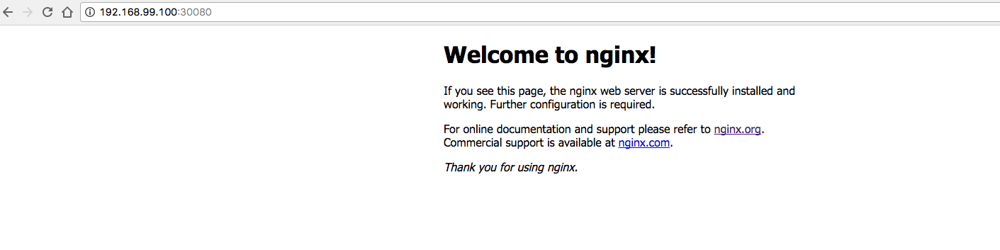

# Lab 3

## Basic tool usage

The aim of this lab is to get familiar with the basics. By the end you'll be able to create, find, modify and delete resources within your cluster.

Code examples for this Lab can be found [here](/kubernetes-101/labs/files)

## Exercises

### 1. Create/Use a namespace

Namespaces are a great way of separating logical workloads, so its a good starting point to learn how to handle them. Feel free to change the _my-namespace_ to something more meaningful, you'll also need to change that in the example files if you do.

Start by listing your namespaces:

```bash
kubectl get ns
```

Now create your own namespace:

```bash
kubectl create ns my-namespace
```

You can validate that its been created by listing the namespaces again. You can now use the namespace when using other kubectl commands. For example the following command should return _"No resources found."_:

```bash
kubectl get pods -n my-namespace
```

But if you run the command against the kube-system namespace you'll see lots of pods returned:

```bash
kubectl get pods -n kube-system
```

**NOTE:** if you install kubectx you'll also have a command called kubens, this will allow you to change and set the default namespace that kubectl uses easily.

### 2. Start a pod

Now we have our own workspace we can start services in this and quickly find the resources we create. Start bt creating a new file ```pod.yaml``` with the following contents and be sure to edit the _my-namespace_ to match the one you just created:

```yaml
apiVersion: v1
kind: Pod
metadata:
  name: nginx-pod
  namespace: my-namespace
  labels:
    name: nginx-pod
spec:
  containers:
  - name: nginx
    image: nginx:1.13.5
    ports:
    - containerPort: 80
```

This file is going to start us a single pod with a single container running nginx version 1.13.5. To create this in the cluster run the command:

```bash
kubectl create -f pod.yaml
```

Now lets validate the container is running:

```bash
kubectl get po -n my-namespace
NAME        READY     STATUS    RESTARTS   AGE
nginx-pod   1/1       Running   0          6s
```

You can dive further into the information about this container by running the following:

```bash
kubectl describe po nginx-pod -n my-namespace
```

You'll get lots of information including the IP kubernetes has assigned the pod on the internal network. However this won't be routable so lets move onto the next exercise.

### 3. Add a service / ingress

So we want to test that our new pod is working and browse to the content it is serving but currently you can only do this from inside the cluster. This is where services come in. Because we are running this in minikube we are going to use a cluster type of **NodePort** which will bind a port to our local cluster. In production you'd more likely create type LoadBalancer.

First of all find out your clusters IP address and make a note of it:

```bash
minikube ip
```

Now lets make a service of Type NodePort, create a file called service.yaml

```yaml
apiVersion: v1
kind: Service
metadata:
  name: nginx-service
  namespace: my-namespace
spec:
  selector:
      name: nginx-pod
  type: NodePort
  ports:
  - protocol: TCP
    port: 80
    nodePort: 30080
```

This file creates a NodePort for us and binds it to port 30080 on the minikube IP address. Internally its looking for a pod with a label _nginx-pod_ as its selector and that pod is running on port 80. Lets go ahead and create the service:

```bash
kubectl create -f service.yaml
```

and to validate this has created we can use the kubectl get command:

```bash
kubectl get services -n my-namespace
```

you should get a similar output:

```bash
NAME            TYPE       CLUSTER-IP   EXTERNAL-IP   PORT(S)        AGE
nginx-service   NodePort   10.0.0.148   <none>        80:30080/TCP   12m
```

The Cluster-IP yet again is an internally routable IP to kubernetes and can be used by other containers in the cluster, either directly or via service discovery. More interesting we can get some information about our new service:

```bash
kubectl describe service nginx-service -n my-namespace

Name:                     nginx-service
Namespace:                my-namespace
Labels:                   <none>
Annotations:              <none>
Selector:                 name=nginx-pod
Type:                     NodePort
IP:                       10.0.0.148
Port:                     <unset>  80/TCP
TargetPort:               80/TCP
NodePort:                 <unset>  30080/TCP
Endpoints:                172.17.0.4:80
Session Affinity:         None
External Traffic Policy:  Cluster
Events:                   <none>
```

Here you can see the service has discovered our container and added its IP to the endpoints. This is good news as it means we are all connected up. Lets go ahead and test this, you'll need the IP address you got from the minikube command earlier and you should be able to browse to http://minikube-ip:30080 the result should be the default nginx page.


(Figure. 1 Deafult nginx page)

### 4. Use a deployment

The examples above get a service running and exposes it to the outside world, however theres is only a single endpoint on the NodePort. If you want some resilience this is where a deployment comes in. A deployment is a configurable ReplicaSet so this allows us to have multiple pods of the same type and scale them up and down, thus adding or removing resource in the service endpoint. Lets create a deployment using the file deployment.yaml

```yaml
apiVersion: apps/v1beta1
kind: Deployment
metadata:
  name: nginx-deployment
  namespace: my-namespace
spec:
  replicas: 2 # tells deployment to run 2 pods matching the template
  template: # create pods using pod definition in this template
    metadata:
      # unlike pod-nginx.yaml, the name is not included in the meta data as a unique name is
      # generated from the deployment name
      labels:
        app: nginx
    spec:
      containers:
      - name: nginx
        image: nginx:1.13.5
        ports:
        - containerPort: 80
```

and lets apply this (apply is like create build can handle updates):

```bash
kubectl apply -f deployment.yaml
```

Now we need a service for this deployment, create a file called deployment-service.yaml:

```yaml
apiVersion: v1
kind: Service
metadata:
  name: nginx-deployment-service
  namespace: my-namespace
spec:
  selector:
      app: nginx
  type: NodePort
  ports:
  - protocol: TCP
    port: 80
    nodePort: 30090
```

```bash
kubectl apply -f deployment-service.yaml
```

You can validate this is running like before and you should note that this time the NodePort is 30090, which you can now check out in your browser.

If you describe the details of this service you'll also notice multiple endpoints.

```bash
kubectl describe service nginx-deployment-service -n my-namespace

Name:                     nginx-deployment-service
Namespace:                my-namespace
Labels:                   <none>
Annotations:              <none>
Selector:                 app=nginx
Type:                     NodePort
IP:                       10.0.0.38
Port:                     <unset>  80/TCP
TargetPort:               80/TCP
NodePort:                 <unset>  30090/TCP
Endpoints:                172.17.0.5:80,172.17.0.6:80
Session Affinity:         None
External Traffic Policy:  Cluster
Events:                   <none>
```

Because we are using a deployment we can now scale the amount of pods up and down. Its pretty simple to do, so we'll try this next. First of all use kubectl to get a list of pods in your namespace. You'll have two named nginx-deployment-<UID>. Now lets scale that to 4 pods:

```bash
kubectl scale deployment nginx-deployment --replicas=4 -n my-namespace
```

now when you list your pods you'll see 4 nginx-deployments-<UID> containers running. Also you will see the service has dynamically updated with extra endpoints:

```bash
kubectl describe service nginx-deployment-service -n my-namespace

Name:                     nginx-deployment-service
Namespace:                my-namespace
Labels:                   <none>
Annotations:              <none>
Selector:                 app=nginx
Type:                     NodePort
IP:                       10.0.0.38
Port:                     <unset>  80/TCP
TargetPort:               80/TCP
NodePort:                 <unset>  30090/TCP
Endpoints:                172.17.0.5:80,172.17.0.6:80,172.17.0.7:80 + 1 more...
Session Affinity:         None
External Traffic Policy:  Cluster
Events:                   <none>
```

To scale down simply reduce the replicas in the command.

**NOTE:** Even if deploying a single container its worth always using a deployment to give you future flexibility. You can also scale a deployment by updating the yaml file and using ```kubectl apply -f deployment.yaml```

Its also worth noting you can combine the yaml into a single file to keep parts of deployments together. Here is combined.yaml:

```yaml
apiVersion: apps/v1beta1
kind: Deployment
metadata:
  name: nginx-deployment-combinded
  namespace: my-namespace
spec:
  replicas: 2 # tells deployment to run 2 pods matching the template
  template: # create pods using pod definition in this template
    metadata:
      # unlike pod-nginx.yaml, the name is not included in the meta data as a unique name is
      # generated from the deployment name
      labels:
        app: nginx-combined
    spec:
      containers:
      - name: nginx-combined
        image: nginx:1.13.5
        ports:
        - containerPort: 80
---
apiVersion: v1
kind: Service
metadata:
  name: nginx-deployment-service-combined
  namespace: my-namespace
spec:
  selector:
    app: nginx-combined
  type: NodePort
  ports:
  - protocol: TCP
    port: 80
    nodePort: 30100
```

Now run:

```bash
kubectl apply -f combined.yaml
```

You can test the deployment by going to http://minikube-ip:30100

Another interesting thing to note is that a Deployment/ReplicaSet ensures you always have the correct number of replicas running. Try deleting one of you containers and then look at the get pods output again.

```bash
kubectl delete pod <POD_NAME> -n my-namespace
kubectl get pods -n my-namespace
```

You should see that kubernetes starts a new pod to replace the terminated one.

### 5. Delete pods,services,deployments

Lets tidy up the resources we've just created.

```bash
kubectl delete -f pod.yaml
kubectl delete -f service.yaml
kubectl delete -f deployment.yaml
kubectl delete -f deployment-service.yaml
kubectl delete -f combined.yaml
```

## Exercises

- Lab 1: [Installing k8s tools](/kubernetes-101/labs/00-tools.md)
- Lab 2: [Install Minikube](/kubernetes-101/labs/01-minikube.md)
- Lab 3: [Basic tool usage](/kubernetes-101/labs/02-basic-usage.md)
- Lab 4: [Intermediate tool usage](/kubernetes-101/labs/03-intermediate-usage.md)

##### Labs : [kubernetes-101](/kubernetes-101/) | [kubernetes-201](/kubernetes-201/) | [kubernetes-301](/kubernetes-301/)
