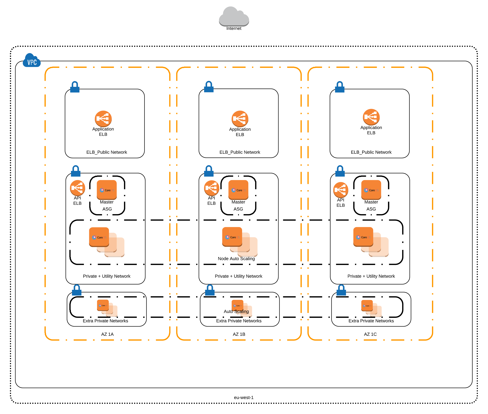

# 201 Introduction

## Overview

In this lab we are going to productionise a k8s cluster using the kops deployment tool. kops is tool to create production clusters and is a single binary much as the minikube minikube tool we used to build a local cluster. kops will provision a k8s cluster for us in AWS and set up the PKI between clients and nodes, set up security groups, EBS volumes, it can also create a VPC and subenets, etc. It'll also set up our local ```kubectl```. Most guides use kops in its default mode in this guide we'll dig a little deeper and deploy our cluster into existing AWS infrastructure. The default behavious for kops is to create a new VPC, subenets, security groups, NAT Gateways and other resources required. However in this lab we are going to use existing an VPC that has subnets configured and NAT Gateways deployed.

### kops

kops helps you create, destroy, upgrade and maintain production-grade, highly available, Kubernetes clusters from the command line. AWS (Amazon Web Services) is currently officially supported, with GCE and VMware vSphere in alpha and other platforms planned.

kops = Kluster Operations

#### Features

- Automates the provisioning of Kubernetes clusters in (AWS)
- Deploys Highly Available (HA) Kubernetes Masters
- Supports upgrading from kube-up
- Built on a state-sync model for dry-runs and automatic idempotency
- Ability to generate configuration files for AWS CloudFormation and Terraform Terraform configuration
- Supports custom Kubernetes add-ons
- Command line autocompletion
- Manifest Based API Configuration
- Community supported!

[Offical page here](https://github.com/kubernetes/kops)

#### Deployment Terminology

When a kops cluster is deployed in High Availibily mode we end up with three master servers and a set of nodes. In kops terms these are known as InstanceGroups (IG's). The IG's map onto amazon autoscale groups. When we spin our cluster up we will see 3 separate master IG's and a Nodes IG.

##### Master IG's/ASG's

Each master is deployed into a different AZ and has its own ASG of 1 server. This allows for you to easily replace a master if it crashes, think of the ASG more as auto healing rather than scaling in this case. 

##### Nodes IG/ASG

Another default is to have a ASG for the nodes. This ASG spans all three AZ's so it starts nodes and spreads them out across the three AZs, which is good for availibilty and stability.

##### Extra Nodes

You can of course tell kops to deploy N nodes in the main node IG, but can also use other IG's. The advantage of being able to create extra IG's comes into play when you label or taint your nodes. It's possible for example to create an extra set of IG's that are dedicated for database container use and use io1 EBS volumes by default for performance. Or you may want a set of nodes with GPU's attached for rendering or computational analytics.

##### Configuration

When you run kops create command it store its configuration and state in a named S3 bucket within AWS. A single S3 bucket can be used for multiple deployments as the configuration is kept under the cluster name within the bucket. The directory/key structure of the bucket is as follows:

```
- clustername
-- addons # contains yaml configs for k8s components
-- instancegroup # instance group configs (ami, disk etc etc)
-- pki # ssh pub keys, client and node certs
-- secrets # k8s secret configs
-- cluster.spec # kops cluster config including docker settings etc
-- config # kops cluster config with main tunable options
```

### Reference Architecture

The diagrams below show a typical deployment of kops when using a prebuilt VPC. We stick to best practice and only deploy instances in private subenets, with ingress to the pods coming through ELB's deployed in the public subnets. This type of configuration does require you to have access to the provate networking via either direct connect or a VPN in order to access the API server with ```kubectl```. 


(Figure 1: AWS reference deployment Architecture)


## Exercises

- Lab 1: [Installing kops](/kubernetes-201/labs/00-install-kops.md)
- Lab 2: [Deploy a cluster](/kubernetes-201/labs/01-deploy-cluster.md)
- Lab 3: [Addons](/kubernetes-201/labs/02-addons.md)
- Lab 4: [Deploy a Stateless Application](/kubernetes-201/labs/03-deploy-service.md) | [Deploy a Stateful Application](/kubernetes-201/labs/03-deploy-stateful-service.md)
- Lab 5: [Upgrade a cluster](/kubernetes-201/labs/04-upgrading.md)

##### Labs : [kubernetes-101](/kubernetes-101/) | [kubernetes-201](/kubernetes-201/) | [kubernetes-301](/kubernetes-301/)
