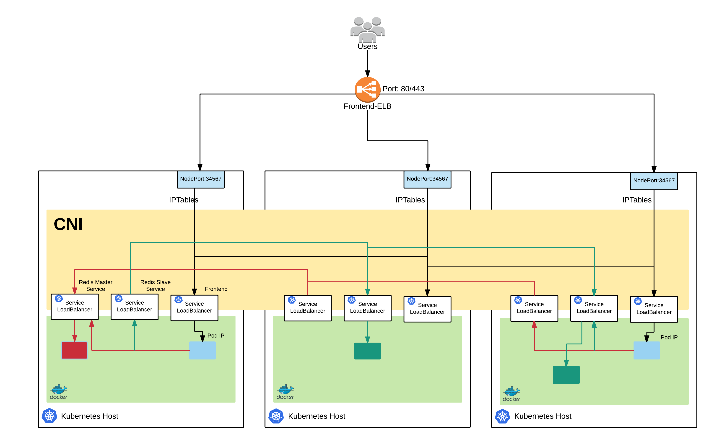

# Lab 4

## Exercises

This set of exercises will build on the kubernetes-101 lab and your knowledge of ```kubectl```, but we will have the opportunity to play with some more advanced features that the cloud providers give us such as External LoadBalancers and Elastic Block Storage. The work load will also be distributed around your cluster due the fact we have multiple nodes.

## Deploy a Stateless application

### 1. Deployment

Lets get started with a deployment, in the first example we are going to deploy the default kubernetes guest book example. It consists of a front end application. The application is stateless so in this example we wont worry about persistent disks (EBS volumes), however we will need to use an ELB to gain access to the service.

Here is a high level over view of what we are going to deploy and how the components interact:


(Figure 1: Stateless Application Deployment)

#### Create and select a namespace

Lets get in good habits and deploy our application into a namespace so all the resources don't end up in the default ns.

```bash
kubectl create ns myname-space
kubens  myname-space
```

#### Start up the Redis Master

The guestbook application uses Redis to store its data. It writes its data to a Redis master instance and reads data from multiple Redis slave instances.

##### Creating the Redis Master Deployment

The manifest file, included below, specifies a Deployment controller that runs a single replica Redis master Pod.

Create the file `redis-master-deployment.yaml`:

```yaml
apiVersion: apps/v1beta1
kind: Deployment
metadata:
  name: redis-master
spec:
  selector:
    matchLabels:
      app: redis
      role: master
      tier: backend
  replicas: 1
  template:
    metadata:
      labels:
        app: redis
        role: master
        tier: backend
    spec:
      containers:
      - name: master
        image: gcr.io/google_containers/redis:e2e  # or just image: redis
        resources:
          requests:
            cpu: 100m
            memory: 100Mi
        ports:
        - containerPort: 6379
```
now lets deploy that:

```bash
kubectl apply -f redis-master-deployment.yaml
```

Query the list of Pods to verify that the Redis Master Pod is running:

```bash
kubectl get pods
```

The response should be similar to this:

```bash
       NAME                            READY     STATUS    RESTARTS   AGE
       redis-master-1068406935-3lswp   1/1       Running   0          28s
```

Run the following command to view the logs from the Redis Master Pod:

```bash
kubectl logs -f POD-NAME
```

**Note:** Replace POD-NAME with the name of your Pod.

##### Creating the Redis Master Service

The guestbook applications needs to communicate to the Redis master to write its data. ALso there are redis slaves that will use this long running (immortal host name) to connect and sync.

Lets create the file `redis-master-service.yaml`:

```yaml
apiVersion: v1
kind: Service
metadata:
  name: redis-master
  labels:
    app: redis
    role: master
    tier: backend
spec:
  ports:
  - port: 6379
    targetPort: 6379
  selector:
    app: redis
    role: master
    tier: backend
```

and deploy it:

```bash
kubectl apply -f redis-master-service.yaml
```

Query the list of Services to verify that the Redis Master Service is running:

```bash
kubectl get service
```

The response should be similar to this:

```bash
       NAME           CLUSTER-IP   EXTERNAL-IP   PORT(S)    AGE
       redis-master   10.0.0.151   <none>        6379/TCP   8s
```

#### Start up the Redis Slaves

Although the Redis master is a single pod, you can make it highly available to meet traffic demands by adding replica Redis slaves. These slaves will use the DNS service inside kubernetes to discover the master and sync up the cluster.

##### Creating the Redis Slave Deployment

This deployment is going to launch two replica's (in this case redis slaves) for us.


Create and Apply the Redis Slave Deployment from the `redis-slave-deployment.yaml` file:

```yaml
apiVersion: apps/v1beta1
kind: Deployment
metadata:
  name: redis-slave
spec:
  selector:
    matchLabels:
      app: redis
      role: slave
      tier: backend
  replicas: 2
  template:
    metadata:
      labels:
        app: redis
        role: slave
        tier: backend
    spec:
      containers:
      - name: slave
        image: gcr.io/google_samples/gb-redisslave:v1
        resources:
          requests:
            cpu: 100m
            memory: 100Mi
        env:
        - name: GET_HOSTS_FROM
          value: dns
          # Using `GET_HOSTS_FROM=dns` requires your cluster to
          # provide a dns service. As of Kubernetes 1.3, DNS is a built-in
          # service launched automatically. However, if the cluster you are using
          # does not have a built-in DNS service, you can instead
          # instead access an environment variable to find the master
          # service's host. To do so, comment out the 'value: dns' line above, and
          # uncomment the line below:
          # value: env
        ports:
        - containerPort: 6379
```

then run:

```bash
kubectl apply -f redis-slave-deployment.yaml
```

Query the list of Pods to verify that the Redis Slave Pods are running:

```bash
kubectl get pods
```

The response should be similar to this:

```bash
       NAME                            READY     STATUS              RESTARTS   AGE
       redis-master-1068406935-3lswp   1/1       Running             0          1m
       redis-slave-2005841000-fpvqc    0/1       ContainerCreating   0          6s
       redis-slave-2005841000-phfv9    0/1       ContainerCreating   0          6s
```

##### Creating the Redis Slave Service

The guestbook application needs to communicate to Redis slaves to read data. To make the Redis slaves discoverable, you need to set up a Service. A Service provides transparent load balancing to a set of Pods.

create a file called `redis-slave-service.yaml`:

```yaml
apiVersion: v1
kind: Service
metadata:
  name: redis-slave
  labels:
    app: redis
    role: slave
    tier: backend
spec:
  ports:
  - port: 6379
  selector:
    app: redis
    role: slave
    tier: backend
```

the apply the file:

```bash
kubectl apply -f redis-slave-service.yaml
```

Query the list of Services to verify that the Redis Slave Service is running:

```bash
kubectl get services
```

The response should be similar to this:

```bash
       NAME           CLUSTER-IP   EXTERNAL-IP   PORT(S)    AGE
       redis-master   10.0.0.151   <none>        6379/TCP   1m
       redis-slave    10.0.0.223   <none>        6379/TCP   6s
```

#### Set up and Expose the Guestbook Frontend

The guestbook application has a web frontend serving the HTTP requests written in PHP. It is configured to connect to the `redis-master` Service for write requests and the `redis-slave` service for Read requests. We are then going to expose this service by using an Elastic LoadBalancer.

##### Creating the Guestbook Frontend Deployment

create the file `frontend-deployment.yaml`:

```yaml
apiVersion: apps/v1beta1
kind: Deployment
metadata:
  name: frontend
spec:
  selector:
    matchLabels:
      app: guestbook
      tier: frontend
  replicas: 3
  template:
    metadata:
      labels:
        app: guestbook
        tier: frontend
    spec:
      containers:
      - name: php-redis
        image: gcr.io/google-samples/gb-frontend:v4
        resources:
          requests:
            cpu: 100m
            memory: 100Mi
        env:
        - name: GET_HOSTS_FROM
          value: dns
          # Using `GET_HOSTS_FROM=dns` requires your cluster to
          # provide a dns service. As of Kubernetes 1.3, DNS is a built-in
          # service launched automatically. However, if the cluster you are using
          # does not have a built-in DNS service, you can instead
          # instead access an environment variable to find the master
          # service's host. To do so, comment out the 'value: dns' line above, and
          # uncomment the line below:
          # value: env
        ports:
        - containerPort: 80
```

Then deploy the yaml to your cluster:

```bash
kubectl apply -f frontend-deployment.yaml
```

Query the list of Pods to verify that the three frontend replicas are running there should be 3 replicas of the front end service running. The example below shows you how to filter the output and only show those pods with the frontend label:

```yaml
kubectl get pods -l app=guestbook -l tier=frontend
```

The response should be similar to this:

```bash
       NAME                        READY     STATUS    RESTARTS   AGE
       frontend-3823415956-dsvc5   1/1       Running   0          54s
       frontend-3823415956-k22zn   1/1       Running   0          54s
       frontend-3823415956-w9gbt   1/1       Running   0          54s
```

##### Creating the Frontend Service

Now we have a fully running site but there is no way to access this site from outside the k8s cluster. So we need to add a service of type LoadBalancer. This will instruct the _cloud-controller-manager_ to deploy an ELB and connect it to a NodePort it opens on the on the masters and nodes. This in turn forwards to a ClusterIP and then to the pods. Create the file `frontend-service.yaml`:

```yaml
apiVersion: v1
kind: Service
metadata:
  name: frontend
  labels:
    app: guestbook
    tier: frontend
spec:
  type: LoadBalancer
  ports:
  - port: 80
  selector:
    app: guestbook
    tier: frontend
```

And deploy the service:

```bash
kubectl apply -f frontend-service.yaml
```

This time when we query the service we are going to add an extra flag to our query so we can get the DNS name of the associated ELB.

```bash
kubectl get services -o wide
```

Make a copy of the ELB address and paste that into your browser. You should now be able to get to the guest book application


(Figure 2: Guestbook Application)

**NOTE:** It may take a little while for the DNS to register the ELB.

### 2. Scale the Web Frontend

Scaling up or down is easy because your servers are defined as a Service that uses a Deployment controller.

Run the following command to scale up the number of frontend Pods:


```bash
kubectl scale deployment frontend --replicas=5
```

Query the list of Pods to verify the number of frontend Pods running:

```bash
kubectl get pods
```

The response should look similar to this:

```bash
       NAME                            READY     STATUS    RESTARTS   AGE
       frontend-3823415956-70qj5       1/1       Running   0          5s
       frontend-3823415956-dsvc5       1/1       Running   0          54m
       frontend-3823415956-k22zn       1/1       Running   0          54m
       frontend-3823415956-w9gbt       1/1       Running   0          54m
       frontend-3823415956-x2pld       1/1       Running   0          5s
       redis-master-1068406935-3lswp   1/1       Running   0          56m
       redis-slave-2005841000-fpvqc    1/1       Running   0          55m
       redis-slave-2005841000-phfv9    1/1       Running   0          55m
```

Run the following command to scale down the number of frontend Pods:

```bash
kubectl scale deployment frontend --replicas=2
```

Query the list of Pods to verify the number of frontend Pods running:

```bash
kubectl get pods
```
You should now see less front ends in the list.

## Exercises

- Lab 1: [Installing kops](/kubernetes-201/labs/00-install-kops.md)
- Lab 2: [Deploy a cluster](/kubernetes-201/labs/01-deploy-cluster.md)
- Lab 3: [Addons](/kubernetes-201/labs/02-addons.md)
- Lab 4: [Deploy a Stateless Application](/kubernetes-201/labs/03-deploy-service.md) | [Deploy a Stateful Application](/kubernetes-201/labs/03-deploy-stateful-service.md)
- Lab 5: [Upgrade a cluster](/kubernetes-201/labs/04-upgrading.md)

##### Labs : [kubernetes-101](/kubernetes-101/) | [kubernetes-201](/kubernetes-201/) | [kubernetes-301](/kubernetes-301/)
