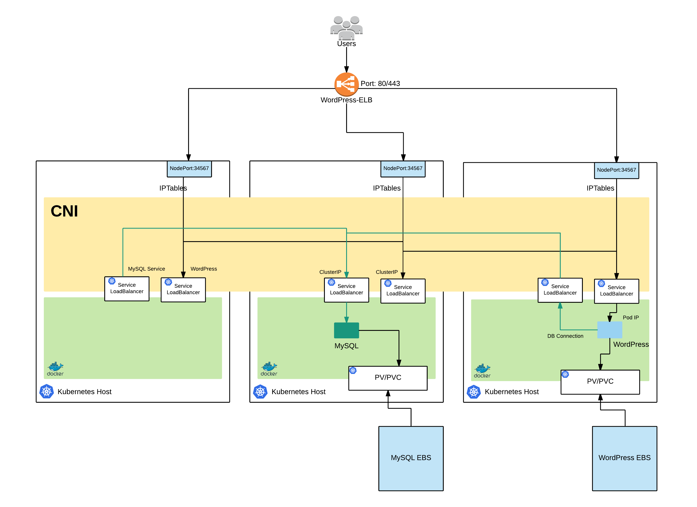

# Lab 4b

## Exercises Continued

## Deploy a Stateful application

In this lab we are going to create a WordPress deployment with persistent storage. This is because we want to keep stateful information such as the data for MySQL and any files you upload to the CMS.

Here is a high level over view of what we are going to deploy and how the components interact, this time you can see we are using persistent volumes:


(Figure 1: Stateful Application Deployment)

### 1. Deploying MySQL

### Create and select a namespace

Lets get in good habits and deploy our application into a namespace so all the resources don't end up in the default ns.

kubectl create ns myname-space
kubens  myname-space

### Secrets

In this deployment we are going to create a service to allow the webserver to connect to MySQL using service discovery and a persistent volume for storing the contents of the database. Lets get going by creating a password for MySQL:

```bash
kubectl create secret generic mysql-pass --from-literal=password=YOUR_PASSWORD
```

This secret is going to be consumed by your deployment to set the password for mysql meaning you dont't have to store passwords in your yaml directly.

### MySQL

Now lets create the deployment file named `mysql-deployment.yaml`:

```yaml
apiVersion: v1
kind: Service
metadata:
  name: wordpress-mysql
  labels:
    app: wordpress
spec:
  ports:
    - port: 3306
  selector:
    app: wordpress
    tier: mysql
  clusterIP: None
---
apiVersion: v1
kind: PersistentVolumeClaim
metadata:
  name: mysql-pv-claim
  labels:
    app: wordpress
spec:
  accessModes:
    - ReadWriteOnce
  resources:
    requests:
      storage: 20Gi
---
apiVersion: apps/v1beta1
kind: Deployment
metadata:
  name: wordpress-mysql
  labels:
    app: wordpress
spec:
  selector:
    matchLabels:
      app: wordpress
      tier: mysql
  strategy:
    type: Recreate
  template:
    metadata:
      labels:
        app: wordpress
        tier: mysql
    spec:
      containers:
      - image: mysql:5.6
        name: mysql
        env:
        - name: MYSQL_ROOT_PASSWORD
          valueFrom:
            secretKeyRef:
              name: mysql-pass
              key: password
        ports:
        - containerPort: 3306
          name: mysql
        volumeMounts:
        - name: mysql-persistent-storage
          mountPath: /var/lib/mysql
      volumes:
      - name: mysql-persistent-storage
        persistentVolumeClaim:
          claimName: mysql-pv-claim
```
After running:

```bash
kubectl create -f mysql-deployment.yaml
```

you should be able to run:

```bash
kubectl get po,svc,pv,pvc
```

This will show you something like the following:

```bash
NAME                                  READY     STATUS              RESTARTS   AGE
po/wordpress-mysql-2917821887-b0l6w   0/1       ContainerCreating   0          23s

NAME                  TYPE        CLUSTER-IP   EXTERNAL-IP   PORT(S)    AGE
svc/wordpress-mysql   ClusterIP   None         <none>        3306/TCP   23s

NAME                                          CAPACITY   ACCESS MODES   RECLAIM POLICY   STATUS    CLAIM                     STORAGECLASS   REASON    AGE
pv/pvc-92325b42-b4ba-11e7-9f3f-0aa38f659e70   20Gi       RWO            Delete           Bound     ric-test/mysql-pv-claim   gp2                      22s

NAME                 STATUS    VOLUME                                     CAPACITY   ACCESS MODES   STORAGECLASS   AGE
pvc/mysql-pv-claim   Bound     pvc-92325b42-b4ba-11e7-9f3f-0aa38f659e70   20Gi       RWO            gp2            23s
```

If you check the AWS console you'll find that k8s has created a EBS volume for us.

### 2. Deploy WordPress

Like the MySQL deployment we want to have a persistent volume for the data in WordPress. So lets create a file called `wordpress-deployment.yaml`:

```yaml
apiVersion: v1
kind: Service
metadata:
  name: wordpress
  labels:
    app: wordpress
    annotations:
      service.beta.kubernetes.io/aws-load-balancer-internal: 0.0.0.0/0
spec:
  ports:
    - port: 80
  selector:
    app: wordpress
    tier: frontend
  type: LoadBalancer
---
apiVersion: v1
kind: PersistentVolumeClaim
metadata:
  name: wp-pv-claim
  labels:
    app: wordpress
spec:
  accessModes:
    - ReadWriteOnce
  resources:
    requests:
      storage: 20Gi
---
apiVersion: apps/v1beta1
kind: Deployment
metadata:
  name: wordpress
  labels:
    app: wordpress
spec:
  selector:
    matchLabels:
      app: wordpress
      tier: frontend
  strategy:
    type: Recreate
  template:
    metadata:
      labels:
        app: wordpress
        tier: frontend
    spec:
      containers:
      - image: wordpress:4.8-apache
        name: wordpress
        env:
        - name: WORDPRESS_DB_HOST
          value: wordpress-mysql
        - name: WORDPRESS_DB_PASSWORD
          valueFrom:
            secretKeyRef:
              name: mysql-pass
              key: password
        ports:
        - containerPort: 80
          name: wordpress
        volumeMounts:
        - name: wordpress-persistent-storage
          mountPath: /var/www/html
      volumes:
      - name: wordpress-persistent-storage
        persistentVolumeClaim:
          claimName: wp-pv-claim
```

In this deployment above we are also using the mysql secret we deployed as an environmental variable so that we can automatically configure the wp-config file for WordPress and have DB connectivity.

Lets deploy WordPress:

```bash
kubectl create -f wordpress-deplyment.yaml
```

Now lets find our service ELB so we can checkout the site:

```bash
kubectl get services wordpress
```

Lets find the service ELB address and test the deployment:

```bash
kubectl get services -o wide
```

Copy the DNS name and browse to this in your browser. Now if you complete the wizard taking care to note your username and password you should be able to setup the default WordPress site.


(Figure 2: WordPress deployed as a Stateful application)

### 3. Testing

Lets test that the stateful deployment has worked. If it has deleting a pod will not result in any data loss. In this test we'll delete the mysql pod. if it recovers correctly you should still see your WordPress site working and not have to initialise the DB again.

```bash
kubectl get po
kubectl delete po wordpress-mysql-...........
```

Now lets wait for it to be replaced:

``bash
kubectl get po
```

Once its in a state of running refresh your website in the browser and you'll see your site is still working.

### 4. Clean up

Lets clean up the resources for the last couple of exercises:

```bash
kubectl delete ns myname-space
```

This will automatically clean up all the resources you've created.

## Exercises

- Lab 1: [Installing kops](/kubernetes-201/labs/00-install-kops.md)
- Lab 2: [Deploy a cluster](/kubernetes-201/labs/01-deploy-cluster.md)
- Lab 3: [Addons](/kubernetes-201/labs/02-addons.md)
- Lab 4: [Deploy a Stateless Application](/kubernetes-201/labs/03-deploy-service.md) | [Deploy a Stateful Application](/kubernetes-201/labs/03-deploy-stateful-service.md)
- Lab 5: [Upgrade a cluster](/kubernetes-201/labs/04-upgrading.md)

##### Labs : [kubernetes-101](/kubernetes-101/) | [kubernetes-201](/kubernetes-201/) | [kubernetes-301](/kubernetes-301/)
